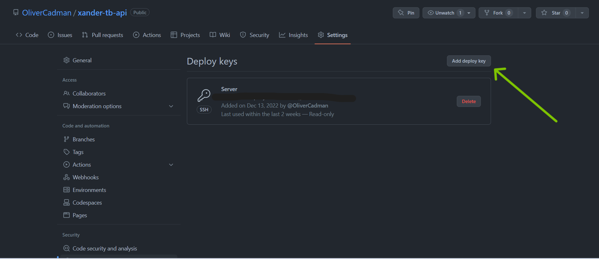

# xander-tb-api
Django REST API to get and post toothbrush sales data

Built using the Django REST Framework. Runs in a Docker container, hosted on an Amazon EC2 instance.

# [ALEXANDRA TRIBE - FOLLOW THIS LINK FOR SETTING UP DOCKER ON EC2](#Deploying-On-EC2)

# Deploy Locally

## Clone this project
Clone this project to a directory in your local machine.

## Build the Dockerfile

1. Open Docker Desktop (this is the Docker 'daemon', and needs to be running in order for your Dockerfile to build).
2. In your terminal, type `docker-compose build` to build the container and to install the dependencies.


## Update your environment variables

## .env.sample file
There are 3 key environment variables that you should add to your .env.sample file:
- DB_PASS: You can use [LastPass](https://www.lastpass.com/features/password-generator) for this.
- DJANGO_SECRET_KEY: There's a dedicated [Django Key Generator](https://miniwebtool.com/django-secret-key-generator/) for this also!
- DJANGO_ALLOWED_HOSTS: Update this with your local (probably something like 'https://127.0.0.1:8000', or '0.0.0.0:8000').

## Create a .env file
1 .Create a `.env` file.
2. Copy all of the environment variables from your `.env.sample` file into your new `.env` file, and save.


## Run the docker-compose-deploy.yml file
1. Open your terminal and navigate to your project's directory.
2. Type `docker-compose -f docker-compose-deploy.yml down`, and run the command. This will remove any images if there are any, so you can start from a clean slate. This is just precautionary.
3. Type `docker-compose -f docker-compose-deploy.yml up`, and run the command.
4. If all is well, you should see something akin to the screenshot below:


5. Navigate to `http://127.0.0.1:8000/api/docs` and you should be see the API Documentation, served on [SwaggerIO](https://swagger.io/)

## ATTENTION!

If you're running this on a Window's machine, you might get an error along the lines of:

```
exec /scripts/run.sh: no such file or directory
/docker-entrypoint.sh: exec: line 47: /run.sh: not found
```

If you encounter this, open both of your `run.sh` files in both your `proxy` and `scripts` folders. In each of the files, navigate to the bottom toolbar on the right, and you should see the letters `CLRF`. Click on that, and a dropdown box should open, with the option to choose `LF`. Select `LF`. Make sure that you do this for both files. 


You will then need to rebuild your container so Docker is made aware of your changes. In your terminal, type these commands:

1. `docker-compose -f docker-compose-deploy.yml down --volumes`
2. `docker-compose -f docker-compose-deploy.yml build`
3. `docker-compose -f docker-compose-deploy.yml up`

All being well, the server should be running locally with no issues!

## Creating a superuser

You can create a Django Administrator 'Superuser' profile, which will allow you to perform CRUD operations from the Django Admin GUI.

1. In your terminal, type `docker-compose -f docker-compose-deploy.yml down`
2. Then, type `docker-compose -f docker-compose-deploy.yml run --rm app sh -c 'python manage.py createsuperuser'`
3. It should then prompt you to enter an email and password for your account.
4. Once that's entered, it should display the message 'Superuser created successfully.'
5. Navigate to 'https://127.0.0.1:8000/admin' and a login page should be displayed, where you can log in as your newly created superuser.


# Deploying on EC2

## Fork the project
Fork the project on Github so you have your own repository. You will need your own repository in order to run the code on your EC2 instance.

Steps on how to fork a Github repo can be found [here](https://docs.github.com/en/get-started/quickstart/fork-a-repo)

## Create an EC2 Instance

1. Login to your AWS account and navigate to the EC2 console.
2. Create and run your new EC2 instance.
3. Connect to the EC2 instance:
    - 
    - 

## Configure Github deploy keys

We need to approve our server to pull the code from Github. You can provide 'Github deploy keys' in your Github account to whitelist your EC2 instance to pull the code.

1. Connect to your new EC2 instance.
2. Type `ssh-keygen -t ed25519 -b 4096`. Hit enter.
3. It should prompt you to select a file in which to save your new SSH keygen. Just click enter.
4. It then will ask your to provide a passphrase, or hit enter to provide no passphrase. Just click enter.
5. Hit enter one more time to confirm your blank passphrase.
6. Type `cat ~/.ssh/id_ed25519.pub`, and click Enter. This will output the public key for this SSH keypair.
7. Copy the output, everything from `ssh-ed25519` to `.ec2.internal`.
8. Head over to your Github Account.
9. Navigate to your forked repository containing this code.
10. Navigate to the repository settings.
    - 
11. Choose `Deploy Keys` and click `Add Deploy Key`.
    - 
    - 

12. Give your key a name, and paste the SSH Public key into the text area with label 'Key'.
13. Leave the checkbox 'Allow Write Access' blank.
14. Click 'Add Key'. Enter your Github password if prompted, and then it should display a success message.
15. Your EC2 instance should now be able to pull the code from your forked repository!

## Install Docker, docker-compose and git in your EC2 instance

You need to install a few extra dependencies in your EC2 instance in order to pull the code and run the Docker configurations.

Use the below commands to configure the EC2 virtual machine running Amazon Linux 2.

Install Git:

```sh
sudo yum install git -y
```

Install Docker, make it auto start and give `ec2-user` permissions to use it:

```sh
sudo amazon-linux-extras install docker -y
sudo systemctl enable docker.service
sudo systemctl start docker.service
sudo usermod -aG docker ec2-user
```

Note: After running the above, you need to logout by typing `exit` and re-connect to the server in order for the permissions to come into effect.

Install Docker Compose:

```sh
sudo curl -L "https://github.com/docker/compose/releases/download/1.29.1/docker-compose-$(uname -s)-$(uname -m)" -o /usr/local/bin/docker-compose
sudo chmod +x /usr/local/bin/docker-compose
```

## Running Docker Service


### Cloning Code

Use Git to clone your project:

```sh
git clone <project ssh url>
```

### Create a .env file

Because .env files should never be available in a Github repo, you will need to create a .env file in your EC2 instance.

1. Navigate to the root of the project.
2. Type `cat .env.sample` and copy all of the placeholder environment variables.
3. Type `vim .env` to create a new .env file.
4. In the VIM editor, hit `I` to enable inserting into the editor.
5. Paste your placeholder environment variables, and replace the values as per the steps outlined in the [Updating Your Environment Variables](#envsample-file) section of this README.
6. Hit `Esc` and `:wq` to save your changes and close the editor.
7. Type `cat .env` to open the file and check if the new environment variables were saved correctly.


### Running Service

To start the service, run:

```sh
docker-compose -f docker-compose-deploy.yml up -d
```

### Stopping Service

To stop the service, run:

```sh
docker-compose -f docker-compose-deploy.yml down
```

To stop service and **remove all data**, run:

```sh
docker-compose -f docker-compose-deploy.yml down --volumes
```

Hopefully this should provide enough detail to get this project up and running for you! 

# Nice One
